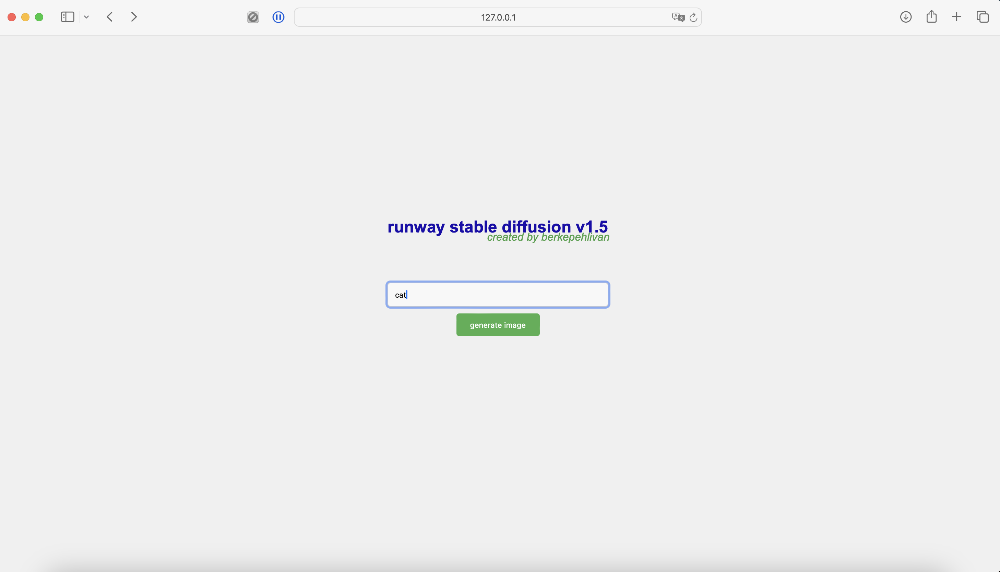
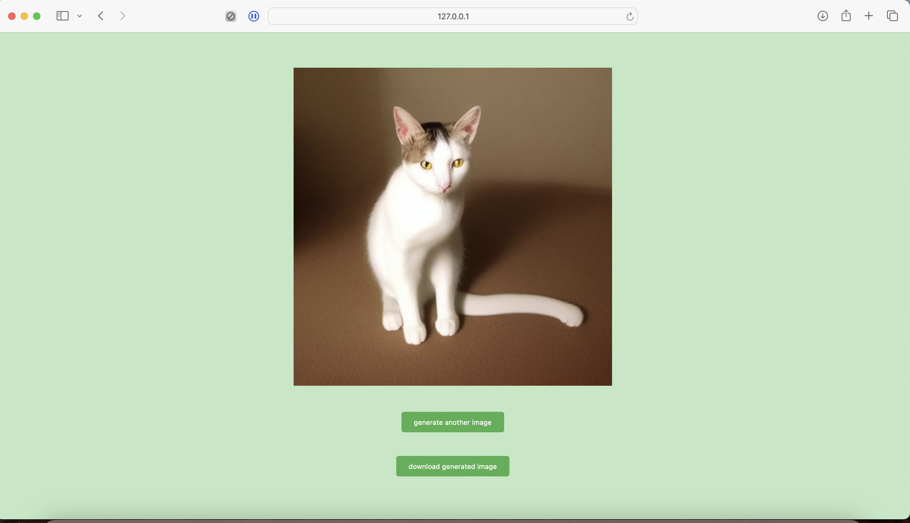

# AI Image Generation Web Application

This is a Flask web application that uses the Runway's Stable Diffusion Inference API from Hugging Face to generate images based on user prompts. The generated images are saved in a static directory and the prompts along with the image paths are stored in an SQLite database.

## Getting Started

These instructions will get you a copy of the project up and running on your local machine for development and testing purposes.

### Prerequisites

You need to have Python installed on your machine. You can download Python [here](https://www.python.org/downloads/).

You also need to install the required Python packages. You can install them using pip:

```bash
pip install flask requests pillow sqlite3
```

### Running the Application

To run the application, navigate to the directory containing the `main.py` file and run the following command:

```bash
python main.py
```

The application will start running on `localhost:5001`.

## Usage

When you open the application in a web browser, you will see a form where you can enter a prompt. After you submit the form, the application will generate an image based on the prompt and display it on the screen.

The application also stores the prompt and the path of the generated image in an SQLite database named `prompts_images.db`.

## Screenshots
Main Page

Result Page


## Built With

* [Python](https://www.python.org/) - The programming language used
* [Flask](https://flask.palletsprojects.com/) - The web framework used
* [SQLite](https://www.sqlite.org/index.html) - Database
* [Pillow](https://pillow.readthedocs.io/en/stable/) - Python Imaging Library
* [Requests](https://docs.python-requests.org/en/latest/) - HTTP library for Python
* [Stable Diffusion](https://huggingface.co/runwayml/stable-diffusion-v1-5) - Runway Stable Diffusion Model from Huggingface

## License

This project is open sourced.See the [LICENSE](LICENSE) file for details.
```
